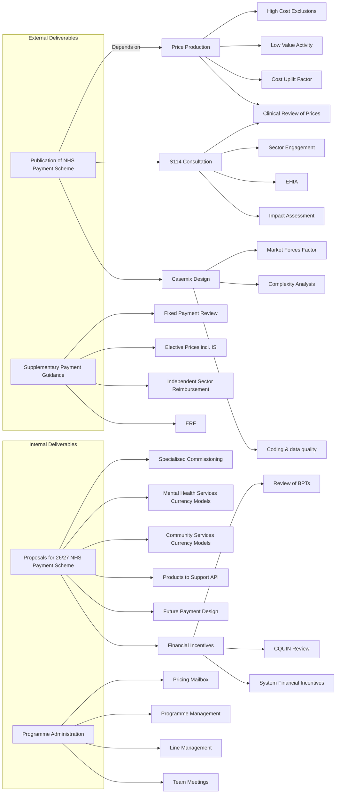
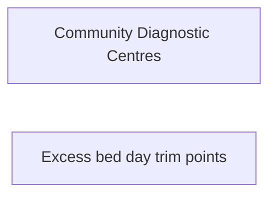

# Payment & Pricing Team Project Matrix

The project matrix describes the lines of responsibility for each piece of work across the team. Here, I attempt to unify the work programme into a single dependency diagram showing the top-level outputs on the left and contributory work packages to the right.

> The arrows represent dependency relations; so A-->B means that B is a dependency of A. Please feed back to Ashley any changes needed.

Things yet to be categorised

